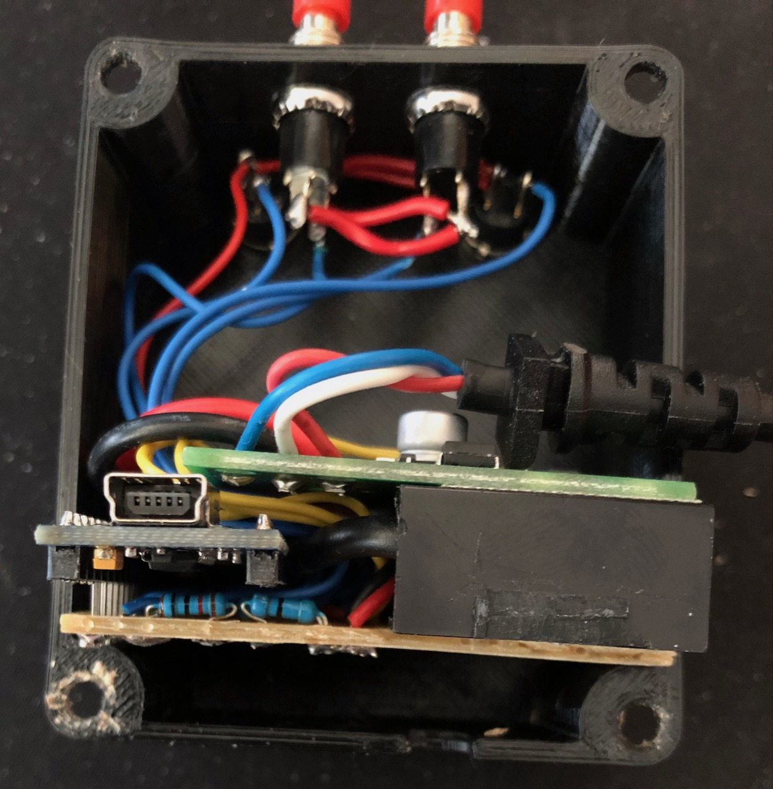
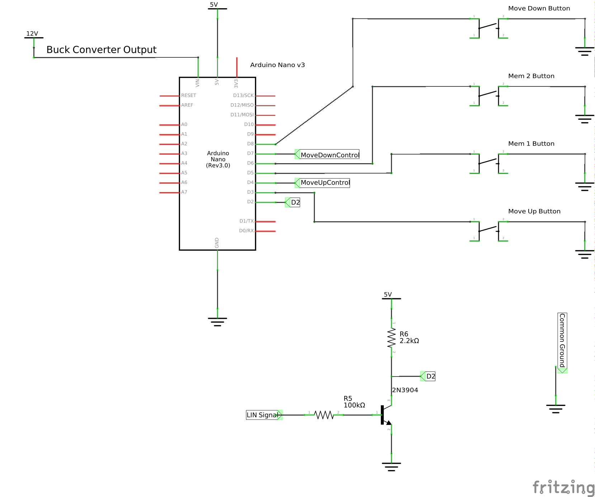

# Changes in this fork
- Added filter for first reported position above max limit. 
  - This prevents the table from moving to lowest position when plugging everything in.
- Some code cleanup

# 3D printed case on Thingiverse
https://www.thingiverse.com/thing:5181601

# IKEA Hackant

A simple LIN slave attached to the stock controller board adds two memory buttons.
If you are interested in how this was developed check out my YouTube Tutorial

## Schematics

Simple schematics created with [Fritzing](http://fritzing.org/home/ "Fritzing").

